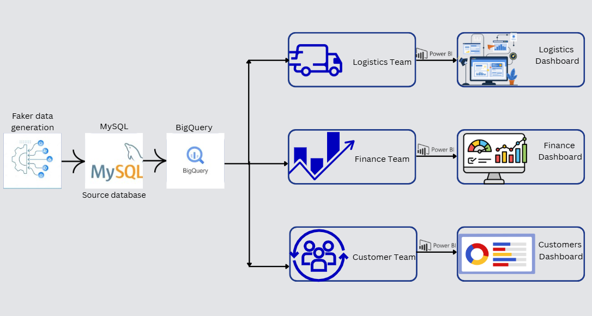

# 🚢 End-to-End Shipping Data Analytics Platform

A complete data analytics pipeline built independently — from raw data generation to multi-team Power BI dashboards — simulating a real-world shipping and logistics business intelligence system.

---

## 📌 Project Overview

This project demonstrates end-to-end ownership of a data analytics workflow:

- **Data Generation** → Realistic transactional data generated using Python (Faker)
- **Storage** → Loaded into MySQL as the source database
- **Pipeline** → Migrated and transformed into Google BigQuery for large-scale analysis
- **Visualisation** → 3 Power BI dashboards built for different business teams

---

## 🏗️ Architecture


```
Faker (Python)  →  MySQL (Source DB)  →  Google BigQuery  →  Power BI Dashboards
                                                              ├── Logistics Dashboard
                                                              ├── Finance Dashboard
                                                              └── Customer Service Dashboard
```

---

## 📊 Dashboards Built

### 1. Logistics Dashboard
Tracks shipment operations and package performance.

**Key Metrics:**
- Total number of shipments (50K)
- Fragile shipment percentage
- Average late fees
- Total discount amount
- Number of shipments by warehouse city
- Package type breakdown and late fees by package type

---

### 2. Finance Dashboard
Monitors financial performance across the business.

**Key Metrics:**
- Total Revenue — 11.87M
- Total Profit — 9.64M
- Total Settlement Given — 523.89K
- Total Discount Given — 500.23K
- Revenue breakdown by month
- Revenue by payment method (credit card, PayPal, cash, bank transfer)
- Claim status tracking (pending, denied, approved)

---

### 3. Customer Service Dashboard
Analyses customer behaviour and support performance.

**Key Metrics:**
- Total Customers — 5,001
- Average Review Score — 3.01
- Average Loyalty Points — 504
- Total Orders — 50K
- Active customers per month (trend line)
- Business vs Individual customer split
- Customers by city (global map view)
- Issue Management — ticket volume, resolution time, issue types
- Average review score by city

---

## 🛠️ Tools & Technologies

| Layer | Tool |
|-------|------|
| Data Generation | Python (Faker, Pandas) |
| Source Database | MySQL |
| Data Warehouse | Google BigQuery |
| Visualisation | Power BI |
| Architecture Design | Canva |

---

## 📁 Project Structure

```
shipping-analytics/
│
├── data_generation/
│   └── generate_data.py        # Faker-based data generation script
│
├── mysql/
│   └── schema.sql              # MySQL table definitions
│
├── bigquery/
│   └── load_to_bq.py           # Pipeline script — MySQL to BigQuery
│
├── dashboards/
│   ├── logistics_dashboard.pbix
│   ├── finance_dashboard.pbix
│   └── customer_dashboard.pbix
│
└── architecture/
    └── pipeline_diagram.png    # End-to-end architecture diagram
```

---

## 🚀 How to Run

### 1. Generate Data
```bash
pip install faker pandas mysql-connector-python
python data_generation/generate_data.py
```

### 2. Set Up MySQL
```bash
mysql -u root -p < mysql/schema.sql
```

### 3. Load to BigQuery
```bash
pip install google-cloud-bigquery
python bigquery/load_to_bq.py
```

### 4. Open Dashboards
Open `.pbix` files in Power BI Desktop and connect to your BigQuery instance.

---

## 💡 Key Learnings

- Designing a data pipeline from scratch with no existing infrastructure
- Handling data type mismatches between MySQL and BigQuery
- Building role-specific dashboards for different business stakeholders
- Creating DAX measures for KPI cards in Power BI
- Structuring a project for readability and reproducibility

---

## 📸 Dashboard Screenshots

### Logistics Overview


### Finance Overview


### Customer Service Insights


---

## 👤 Author

**Nitin Vishwakarma**  
[LinkedIn](http://www.linkedin.com/in/nitin-vishwakarma189) | [GitHub](https://github.com/Nitinz189)  
Open to Data Analyst and MIS Analyst opportunities.

---

## ⭐ If you found this project useful, feel free to star the repository!
